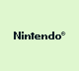
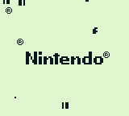
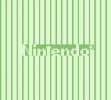
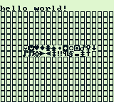
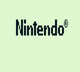

# DMG-report

DMG and CGB (Game Boy and Color GameBoy) game programming tutorials in assembly compiled with [RGBDS](https://github.com/rednex/rgbds)

|  |  |  |  |
| -- | -- | -- | -- |
|  |  |  |  |

The goal of this repository is to contain minimal code designed to teach the basics of creating assembly games for the GameBoy and GameBoy Color. This repository assumes two things: You'll be compiling with [RGBDS](https://github.com/rednex/rgbds) and that you'll be testing with [BGB](http://bgb.bircd.org/).

We start with teaching how to scroll the background, then move to sprite movement, capturing input from the gameboy's joypad, and then setting colors on the background and sprites.

#### Compiling

You can compile each example by running the running the following script:
```
rgbasm -o <filename.obj> <filename.asm>
rgblink -o a.gb <filename.obj>
rgbfix -v -p0 a.gb
rm <filename.obj>
```
so building the file `01_minimal_template.asm` as an example:
```
rgbasm -o 01_minimal_template.obj 01_minimal_template.asm
rgblink -o a.gb 01_minimal_template.obj
rgbfix -v -p0 a.gb
rm 01_minimal_template.obj
```
Now you can run the built game with bgb: Start up bgb and drag and drop / open the file. Or you can launch it through the command-line:
linux:
`wine ~/path/to/bgb/bgb.exe a.gb`
windows:
`path/to/bgb/bgb.exe a.gb`
